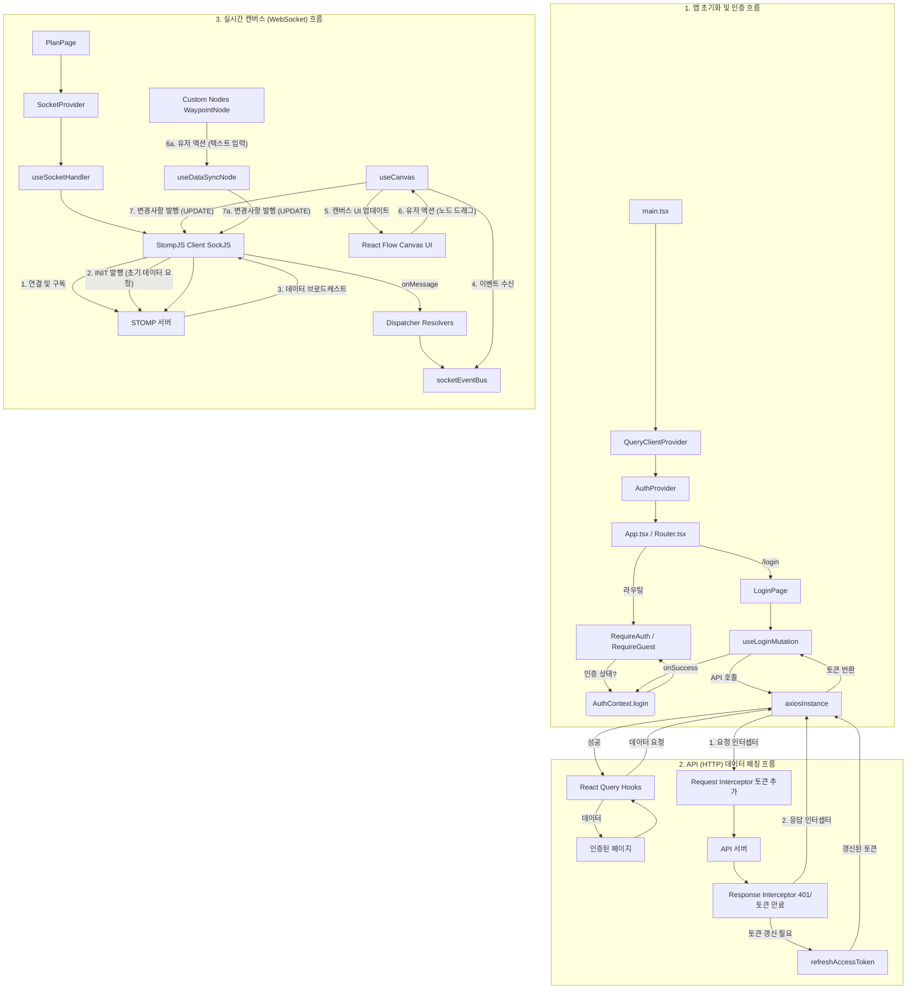

# [Journey Planner](https://www.journey-planner.org/) FE

**Journey Planner**는 사용자가 시각적인 캔버스 위에서 여행 일정을 손쉽게 계획하고 친구들과 실시간으로 공유하며 협업할 수 있는 웹 서비스입니다.

---

## 📖 서비스 소개

여행을 계획하는 과정은 종종 복잡하고 번거롭습니다. 여러 장소, 경로, 메모를 텍스트로만 관리하기는 어렵고, 여러 명의 친구와 계획을 동기화하는 것은 더욱 힘듭니다.

Journey Planner는 이러한 문제점을 해결하기 위해 **시각적인 플로우 캔버스**를 제공합니다. 사용자는 지도처럼 펼쳐진 캔버스 위에 **경유지(Waypoint)** 노드를 추가하고, 노드 간에 **경로(Route)** 엣지를 연결하여 전체 여행의 흐름을 한눈에 파악할 수 있습니다. 또한 **메모(Memo)** 노드를 통해 필요한 정보를 캔버스 어디에나 자유롭게 기록할 수 있습니다.

이 모든 과정은 **웹소켓(STOMP)**을 통해 **실시간으로 동기화**됩니다. 친구를 계획에 초대하면, 모든 참여자가 동시에 캔버스를 편집하고 변경 사항을 즉시 확인할 수 있어 진정한 실시간 협업이 가능합니다.

- [시연 영상](https://youtu.be/gdWLYMNU3ig)

## 🌟 주요 기능

* **시각적 일정 관리:** React Flow 캔버스를 통해 경유지(방문지), 경로(이동수단), 메모를 추가하고 시각적으로 배치합니다.
* **실시간 협업:** 웹소켓(STOMP)을 활용하여 여러 사용자가 동시에 캔버스에 접속해 일정을 편집하고 변경 사항을 실시간으로 공유받습니다.
* **사용자 인증:** 이메일/비밀번호 기반의 회원가입 및 토큰(Access/Refresh) 기반의 로그인 기능을 제공합니다.
* **초대 및 참여:** 이메일로 여행 계획에 친구를 초대하고, '받은 편지함'에서 초대를 수락/관리할 수 있습니다.
* **'나의 스페이스' (대시보드):** 사용자가 참여한 모든 여행 계획을 확인하고, 새로운 계획을 생성하며, 프로필(MBTI 등)을 관리할 수 있습니다.
* **PDF 내보내기:** 완성된 여행 일정을 깔끔한 PDF 문서로 다운로드할 수 있습니다.

## 📂 프로젝트 아키텍처

프로젝트의 소스 폴더 구조는 기능과 역할에 분리되어 있습니다.
```
└── src/
    ├── api/           # Axios 인스턴스, 엔드포인트, API 타입 정의
    ├── assets/        # 아이콘(SVG 컴포넌트)
    ├── components/    # 라우터, 모달, 스피너 등 공용 컴포넌트
    ├── contexts/      # 전역 상태 Context
    ├── hooks/         # 공용 커스텀 훅
    ├── pages/         # 페이지 단위의 최상위 컴포넌트
    │   ├── home/      # 메인 대시보드
    │   ├── inbox/     # 초대받은 편지함
    │   ├── landing/   # 랜딩 페이지
    │   ├── login/     # 로그인
    │   ├── plan/      # ⭐ 핵심 기능: 일정 캔버스 페이지
    │   │   ├── components/  # Plan 페이지 전용 컴포넌트
    │   │   ├── context/     # SocketContext
    │   │   ├── flow/        # React Flow 캔버스, 커스텀 노드/엣지
    │   │   ├── hooks/       # Plan 페이지 전용 훅 (소켓, 캔버스)
    │   │   └── pdf/         # PDF 생성 및 템플릿
    │   ├── register/  # 회원가입
    │   └── space/     # 나의 스페이스 (프로필, 계획 목록)
    ├── styles/        # 전역 스타일, 컬러/폰트 시스템
    ├── types/         # 전역 타입 정의
    └── utils/         # 유틸리티 함수 (경로, API 에러 핸들링)
```

- 폴더 구조 그래프 시각화

```mermaid
graph TD
    root[kakao-tech-campus-3rd-step3-team8_fe]
    root --> README.md
    root --> build.sh
    root --> eslint.config.js
    root --> index.html
    root --> package.json
    root --> tsconfig.app.json
    root --> tsconfig.json
    root --> tsconfig.node.json
    root --> vercel.json
    root --> vite.config.ts
    root --> .gitmessage
    root --> .prettierrc

    %% docs
    root --> docs
    docs --> docs_SharedComponentDoc.md[SharedComponentDoc.md]

    %% public
    root --> public
    public --> public_fonts[fonts]
    public_fonts --> public_fonts_pretendard[pretendard]
    public_fonts_pretendard --> public_fonts_pretendard_css[pretendardvariable.css]

    %% src
    root --> src
    src --> src_App.tsx[App.tsx]
    src --> src_index.css[index.css]
    src --> src_main.tsx[main.tsx]
    src --> src_vite-env.d.ts[vite-env.d.ts]

    %% src/api
    src --> src_api[api]
    src_api --> src_api_axiosInstance.ts[axiosInstance.ts]
    src_api --> src_api_endpoints.ts[endpoints.ts]
    src_api --> src_api_types[types]
    src_api_types --> src_api_types_planCanvasType.ts[planCanvasType.ts]
    src_api_types --> src_api_types_planDetail.ts[planDetail.ts]
    src_api_types --> src_api_types_traveler.ts[traveler.ts]

    %% src/assets
    src --> src_assets[assets]
    src_assets --> src_assets_icons[icons]
    src_assets_icons --> src_assets_icons_Add.tsx[Add.tsx]
    src_assets_icons --> src_assets_icons_ArrowBackiOS.tsx[ArrowBackiOS.tsx]
    src_assets_icons --> src_assets_icons_Close.tsx[Close.tsx]
    src_assets_icons --> src_assets_icons_Delete.tsx[Delete.tsx]
    src_assets_icons --> src_assets_icons_Edit.tsx[Edit.tsx]
    src_assets_icons --> src_assets_icons_FlagCircle.tsx[FlagCircle.tsx]
    src_assets_icons --> src_assets_icons_NoteAlt.tsx[NoteAlt.tsx]

    %% src/components
    src --> src_components[components]
    src_components --> src_components_ErrorBoundary.tsx[ErrorBoundary.tsx]
    src_components --> src_components_FormInputField.tsx[FormInputField.tsx]
    src_components --> src_components_FormSelectField.tsx[FormSelectField.tsx]
    src_components --> src_components_Modal.tsx[Modal.tsx]
    src_components --> src_components_Router.tsx[Router.tsx]
    src_components --> src_components_Spinner.tsx[Spinner.tsx]
    src_components --> src_components_TopBar.tsx[TopBar.tsx]
    src_components --> src_components_routes[routes]
    src_components_routes --> src_components_routes_RequireAuth.tsx[RequireAuth.tsx]
    src_components_routes --> src_components_routes_RequireGuest.tsx[RequireGuest.tsx]

    %% src/contexts
    src --> src_contexts[contexts]
    src_contexts --> src_contexts_AuthContext.tsx[AuthContext.tsx]

    %% src/hooks
    src --> src_hooks[hooks]
    src_hooks --> src_hooks_useAuth.ts[useAuth.ts]
    src_hooks --> src_hooks_useBlockScroll.ts[useBlockScroll.ts]
    src_hooks --> src_hooks_useModal.tsx[useModal.tsx]
    src_hooks --> src_hooks_usePageRouting.ts[usePageRouting.ts]

    %% src/mocks
    src --> src_mocks[mocks]
    src_mocks --> src_mocks_data.ts[data.ts]

    %% src/pages
    src --> src_pages[pages]
    
    %% src/pages/home
    src_pages --> src_pages_home[home]
    src_pages_home --> src_pages_home_HomePage.tsx[HomePage.tsx]
    src_pages_home --> src_pages_home_components[components]
    src_pages_home_components --> src_pages_home_components_Banner.tsx[Banner.tsx]
    src_pages_home_components --> src_pages_home_components_NavLinks.tsx[NavLinks.tsx]
    src_pages_home_components --> src_pages_home_components_TripSection.tsx[TripSection.tsx]
    src_pages_home --> src_pages_home_hooks[hooks]
    src_pages_home_hooks --> src_pages_home_hooks_useMemberQuery.ts[useMemberQuery.ts]
    src_pages_home_hooks --> src_pages_home_hooks_usePlansQuery.ts[usePlansQuery.ts]

    %% src/pages/inbox
    src_pages --> src_pages_inbox[inbox]
    src_pages_inbox --> src_pages_inbox_InboxPage.tsx[InboxPage.tsx]
    src_pages_inbox --> src_pages_inbox_components[components]
    src_pages_inbox_components --> src_pages_inbox_components_InvitationCard.tsx[InvitationCard.tsx]
    src_pages_inbox --> src_pages_inbox_hooks[hooks]
    src_pages_inbox_hooks --> src_pages_inbox_hooks_useAcceptInvitation.ts[useAcceptInvitation.ts]
    src_pages_inbox_hooks --> src_pages_inbox_hooks_useInvitationQuery.ts[useInvitationQuery.ts]
    src_pages_inbox_hooks --> src_pages_inbox_hooks_usePlansFromInvitations.ts[usePlansFromInvitations.ts]

    %% src/pages/landing
    src_pages --> src_pages_landing[landing]
    src_pages_landing --> src_pages_landing_LandingPage.tsx[LandingPage.tsx]
    src_pages_landing --> src_pages_landing_LoginButton.tsx[LoginButton.tsx]
    src_pages_landing --> src_pages_landing_RegisterButton.tsx[RegisterButton.tsx]

    %% src/pages/login
    src_pages --> src_pages_login[login]
    src_pages_login --> src_pages_login_LoginPage.tsx[LoginPage.tsx]
    src_pages_login --> src_pages_login_hooks[hooks]
    src_pages_login_hooks --> src_pages_login_hooks_useLoginForm.ts[useLoginForm.ts]
    src_pages_login_hooks --> src_pages_login_hooks_useLoginMutation.ts[useLoginMutation.ts]
    src_pages_login --> src_pages_login_utils[utils]
    src_pages_login_utils --> src_pages_login_utils_loginValidation.ts[loginValidation.ts]

    %% src/pages/plan
    src_pages --> src_pages_plan[plan]
    src_pages_plan --> src_pages_plan_PlanPage.tsx[PlanPage.tsx]
    src_pages_plan --> src_pages_plan_components[components]
    src_pages_plan_components --> src_pages_plan_components_ControlBar.tsx[ControlBar.tsx]
    src_pages_plan_components --> src_pages_plan_components_ExportModal.tsx[ExportModal.tsx]
    src_pages_plan_components --> src_pages_plan_components_InvitationModalContent.tsx[InvitationModalContent.tsx]
    src_pages_plan_components --> src_pages_plan_components_InvitationPanel.tsx[InvitationPanel.tsx]
    src_pages_plan_components --> src_pages_plan_components_icons[icons]
    src_pages_plan_components_icons --> src_pages_plan_components_icons_CollapseIcon.tsx[CollapseIcon.tsx]
    src_pages_plan_components_icons --> src_pages_plan_components_icons_PlusIcon.tsx[PlusIcon.tsx]
    src_pages_plan --> src_pages_plan_context[context]
    src_pages_plan_context --> src_pages_plan_context_SocketContext.tsx[SocketContext.tsx]
    src_pages_plan --> src_pages_plan_data[data]
    src_pages_plan_data --> src_pages_plan_data_dummyUsers.ts[dummyUsers.ts]
    src_pages_plan --> src_pages_plan_flow[flow]
    src_pages_plan_flow --> src_pages_plan_flow_Canvas.tsx[Canvas.tsx]
    src_pages_plan_flow --> src_pages_plan_flow_edgeTypes.ts[edgeTypes.ts]
    src_pages_plan_flow --> src_pages_plan_flow_nodeTypes.ts[nodeTypes.ts]
    src_pages_plan_flow --> src_pages_plan_flow_canvasComponents[canvasComponents]
    src_pages_plan_flow_canvasComponents --> src_pages_plan_flow_canvasComponents_Memo.ts[Memo.ts]
    src_pages_plan_flow_canvasComponents --> src_pages_plan_flow_canvasComponents_Route.ts[Route.ts]
    src_pages_plan_flow_canvasComponents --> src_pages_plan_flow_canvasComponents_Waypoint.ts[Waypoint.ts]
    src_pages_plan_flow --> src_pages_plan_flow_edges[edges]
    src_pages_plan_flow_edges --> src_pages_plan_flow_edges_RouteEdge.tsx[RouteEdge.tsx]
    src_pages_plan_flow --> src_pages_plan_flow_nodes[nodes]
    src_pages_plan_flow_nodes --> src_pages_plan_flow_nodes_CustomTimeInput.tsx[CustomTimeInput.tsx]
    src_pages_plan_flow_nodes --> src_pages_plan_flow_nodes_MemoNode.tsx[MemoNode.tsx]
    src_pages_plan_flow_nodes --> src_pages_plan_flow_nodes_WaypointNode.tsx[WaypointNode.tsx]
    src_pages_plan_flow --> src_pages_plan_flow_responsive[responsive]
    src_pages_plan_flow_responsive --> src_pages_plan_flow_responsive_EditGuard.tsx[EditGuard.tsx]
    src_pages_plan --> src_pages_plan_hooks[hooks]
    src_pages_plan_hooks --> src_pages_plan_hooks_useAutosizeInput.ts[useAutosizeInput.ts]
    src_pages_plan_hooks --> src_pages_plan_hooks_useCanvas.ts[useCanvas.ts]
    src_pages_plan_hooks --> src_pages_plan_hooks_useDataSyncEdge.ts[useDataSyncEdge.ts]
    src_pages_plan_hooks --> src_pages_plan_hooks_useDataSyncNode.ts[useDataSyncNode.ts]
    src_pages_plan_hooks --> src_pages_plan_hooks_useFetchCanvas.ts[useFetchCanvas.ts]
    src_pages_plan_hooks --> src_pages_plan_hooks_useFetchPlanDetail.ts[useFetchPlanDetail.ts]
    src_pages_plan_hooks --> src_pages_plan_hooks_useSocket.ts[useSocket.ts]
    src_pages_plan_hooks --> src_pages_plan_hooks_useSocketHandler.tsx[useSocketHandler.tsx]
    src_pages_plan --> src_pages_plan_pdf[pdf]
    src_pages_plan_pdf --> src_pages_plan_pdf_PDFSave.tsx[PDFSave.tsx]
    src_pages_plan_pdf --> src_pages_plan_pdf_PDFTemplate.tsx[PDFTemplate.tsx]
    src_pages_plan_pdf --> src_pages_plan_pdf_data[data]
    src_pages_plan_pdf_data --> src_pages_plan_pdf_data_example.ts[example.ts]
    src_pages_plan_pdf_data --> src_pages_plan_pdf_data_examplePDFView.tsx[examplePDFView.tsx]
    src_pages_plan_pdf_data --> src_pages_plan_pdf_data_templates[templates]
    src_pages_plan_pdf_data_templates --> src_pages_plan_pdf_data_templates_1[pdfTemplate_1.html]
    src_pages_plan_pdf_data_templates --> src_pages_plan_pdf_data_templates_2[pdfTemplate_2.html]
    src_pages_plan_pdf_data_templates --> src_pages_plan_pdf_data_templates_3[pdfTemplate_3.html]
    src_pages_plan_pdf_data_templates --> src_pages_plan_pdf_data_templates_4[pdfTemplate_4.html]
    src_pages_plan_pdf_data_templates --> src_pages_plan_pdf_data_templates_5[pdfTemplate_5.html]
    src_pages_plan_pdf --> src_pages_plan_pdf_types[types]
    src_pages_plan_pdf_types --> src_pages_plan_pdf_types_PDFDataType.ts[PDFDataType.ts]
    src_pages_plan --> src_pages_plan_types[types]
    src_pages_plan_types --> src_pages_plan_types_baseResponseBodyType.ts[baseResponseBodyType.ts]
    src_pages_plan_types --> src_pages_plan_types_initTask.ts[initTask.ts]
    src_pages_plan_types --> src_pages_plan_types_memoResponseBodyType.ts[memoResponseBodyType.ts]
    src_pages_plan_types --> src_pages_plan_types_routeResponseBodyType.ts[routeResponseBodyType.ts]
    src_pages_plan_types --> src_pages_plan_types_user.ts[user.ts]
    src_pages_plan_types --> src_pages_plan_types_waypointResponseBodyType.ts[waypointResponseBodyType.ts]
    src_pages_plan --> src_pages_plan_utils[utils]
    src_pages_plan_utils --> src_pages_plan_utils_Category.tsx[Category.tsx]
    src_pages_plan_utils --> src_pages_plan_utils_dateUtils.ts[dateUtils.ts]
    src_pages_plan_utils --> src_pages_plan_utils_initDependencies.ts[initDependencies.ts]
    src_pages_plan_utils --> src_pages_plan_utils_memoDispatcherResolver.ts[memoDispatcherResolver.ts]
    src_pages_plan_utils --> src_pages_plan_utils_routeDispatcherResolver.ts[routeDispatcherResolver.ts]
    src_pages_plan_utils --> src_pages_plan_utils_sessionIdParser.ts[sessionIdParser.ts]
    src_pages_plan_utils --> src_pages_plan_utils_stompURL.ts[stompURL.ts]
    src_pages_plan_utils --> src_pages_plan_utils_topology.ts[topology.ts]
    src_pages_plan_utils --> src_pages_plan_utils_travelerDispatcherResolver.ts[travelerDispatcherResolver.ts]
    src_pages_plan_utils --> src_pages_plan_utils_waypointDispatcherResolver.ts[waypointDispatcherResolver.ts]

    %% src/pages/register
    src_pages --> src_pages_register[register]
    src_pages_register --> src_pages_register_RegisterPage.tsx[RegisterPage.tsx]
    src_pages_register --> src_pages_register_hooks[hooks]
    src_pages_register_hooks --> src_pages_register_hooks_useRegisterForm.ts[useRegisterForm.ts]
    src_pages_register_hooks --> src_pages_register_hooks_useRegisterMutation.ts[useRegisterMutation.ts]
    src_pages_register --> src_pages_register_utils[utils]
    src_pages_register_utils --> src_pages_register_utils_registerValidation.ts[registerValidation.ts]

    %% src/pages/space
    src_pages --> src_pages_space[space]
    src_pages_space --> src_pages_space_SpacePage.tsx[SpacePage.tsx]
    src_pages_space --> src_pages_space_components[components]
    src_pages_space_components --> src_pages_space_components_planspace[planspace]
    src_pages_space_components_planspace --> src_pages_space_components_planspace_DeletionConfirmWindow.tsx[DeletionConfirmWindow.tsx]
    src_pages_space_components_planspace --> src_pages_space_components_planspace_NewPlanWindow.tsx[NewPlanWindow.tsx]
    src_pages_space_components_planspace --> src_pages_space_components_planspace_PlanCard.tsx[PlanCard.tsx]
    src_pages_space_components_planspace --> src_pages_space_components_planspace_PlanSpace.tsx[PlanSpace.tsx]
    src_pages_space_components --> src_pages_space_components_profile[profile]
    src_pages_space_components_profile --> src_pages_space_components_profile_InfoEditWindow.tsx[InfoEditWindow.tsx]
    src_pages_space_components_profile --> src_pages_space_components_profile_Profile.tsx[Profile.tsx]
    src_pages_space --> src_pages_space_hooks[hooks]
    src_pages_space_hooks --> src_pages_space_hooks_useEditForm.ts[useEditForm.ts]
    src_pages_space_hooks --> src_pages_space_hooks_useNewPlanForm.ts[useNewPlanForm.ts]
    src_pages_space --> src_pages_space_styles[styles]
    src_pages_space_styles --> src_pages_space_styles_modalWindowStyle.ts[modalWindowStyle.ts]
    src_pages_space --> src_pages_space_types[types]
    src_pages_space_types --> src_pages_space_types_plan.ts[plan.ts]
    src_pages_space --> src_pages_space_utils[utils]
    src_pages_space_utils --> src_pages_space_utils_editValidation.ts[editValidation.ts]
    src_pages_space_utils --> src_pages_space_utils_planValidation.ts[planValidation.ts]

    %% src/styles
    src --> src_styles[styles]
    src_styles --> src_styles_colorSystem.ts[colorSystem.ts]
    src_styles --> src_styles_fontSystem.ts[fontSystem.ts]

    %% src/types
    src --> src_types[types]
    src_types --> src_types_auth-events.d.ts[auth-events.d.ts]
    src_types --> src_types_member.ts[member.ts]

    %% src/utils
    src --> src_utils[utils]
    src_utils --> src_utils_apiError.ts[apiError.ts]
    src_utils --> src_utils_path.ts[path.ts]
    src_utils --> src_utils_storageKeys.ts[storageKeys.ts]

    %% .github
    root --> .github
    .github --> .github_PULL_REQUEST_TEMPLATE.md[PULL_REQUEST_TEMPLATE.md]
    .github --> .github_ISSUE_TEMPLATE[ISSUE_TEMPLATE]
    .github_ISSUE_TEMPLATE --> .github_ISSUE_TEMPLATE_bug_report.yml[bug_report.yml]
    .github_ISSUE_TEMPLATE --> .github_ISSUE_TEMPLATE_feture-template.md[feture-template.md]
    .github --> .github_workflows[workflows]
    .github_workflows --> .github_workflows_deploy.yml[deploy.yml]
```


---

## 🛠️ 기술 스택 및 아키텍처

본 프로젝트는 모던 프론트엔드 기술 스택을 기반으로 구축되었습니다.

### Frontend

| 구분 | 기술 | 설명 |
| :--- | :--- | :--- |
| **Core** | **React 19, TypeScript** | 컴포넌트 기반 UI 라이브러리와 정적 타입 시스템 |
| **Build Tool** | **Vite** | 빠르고 효율적인 프론트엔드 빌드 도구 |
| **State Management** | **React Query (TanStack Query)** | 서버 상태(API 데이터) 관리, 캐싱, 동기화 |
| | **React Context** | 클라이언트 전역 상태 관리 (인증, 소켓) |
| **Routing** | **React Router v7** | 선언적 라우팅 및 페이지 네비게이션 |
| **Styling** | **Styled-Components** | CSS-in-JS를 통한 동적 컴포넌트 스타일링 |
| **Forms** | **React Hook Form, Zod** | 폼 상태 관리 및 스키마 기반 유효성 검사 |
| **API Client** | **Axios** | HTTP 통신 및 토큰 자동 갱신 인터셉터 구현 |
| **Real-time** | **Stomp.js, SockJS** | STOMP 프로토콜을 이용한 웹소켓 실시간 통신 |
| **Canvas** | **React Flow (`@xyflow/react`)** | 노드/엣지 기반의 시각적 캔버스 구현 |
| **Deployment** | **Vercel, GitHub Actions** | Vercel 배포 및 GitHub Actions를 통한 CI/CD |

## 프로젝트 동작 구조



## 🧑‍💻 팀원 소개

| 프로필 이미지 | 이름 | 역할 | GitHub |
| :--: | :--: | :--: | :--: |
|  | 박수민 | Frontend tech-leader | [https://github.com/Moderator11 |
|  | 김성진 | Frontend | https://github.com/seongjin0320 |
|  | 남규리 | Frontend | https://github.com/whyyhyh |

## 프로젝트 실행

```bash
git clone git@github.com:kakao-tech-campus-3rd-step3/Team8_FE.git
cd Team8_FE
npm install
npm run dev
```

## 커밋 템플릿 설정

프로젝트 최초 clone시 다음 명령어를 실행해 커밋 템플릿을 적용해주세요.
```bash
git config commit.template .gitmessage
```
- 커밋 내용이 많다면 `-m` 옵션 없이 `git commit` 명령어로 템플릿을 사용해 형식에 맞춰 제목과 본문을 작성해주세요

## 알림 설정

레포에서 활동이 일어나면 바로 알 수 있도록(응답시간을 줄일 수 있도록) **watch 설정을 All Activity로 설정**하고, **모바일에서 이메일 알람을 설정**해주세요.


## 디스커션 활용

개발중 생기는 질문, 논의는 이후에 추적이 쉽도록 Discussion을 활용해요!


## 브랜치 전략

### 브랜치 관리

- `main`: 모든 피드백이 반영된 최종 산출 코드 관리
- `refactor` 멘토 피드백 반영
- `develop`: 개발용 코드 관리
- `feature/*`: 기능별 개인 개발용 코드 관리

### 기능 개발

1. 새로운 기능, 페이지를 구현한다면 feature/기능 이름으로 새로운 브랜치를 생성해주세요. e.g. feature/LandingPage

2. 해당 브랜치에서 기능을 개발하세요

3. 개발이 끝나면 PR 템플릿 형식에 맞춰 PR을 생성해주세요 (병합 방향은 `feature/*` -> `develop` 입니다!)

- **다른 사람의 PR이 올라오면 피어 리뷰를 해주세요.**

## 개발 패널 사용방법

개발 서버를 실행시키고 웹을 실행하세요. 오른쪽편에서 **각 패널 위로 마우스를 올려 개발 패널에 접근**할 수 있습니다. (빨간 박스)


### 라우팅 패널
| 컴포넌트 | 기능 |
| :--- | :--- |
| **페이지** | <br> - **페이지 이동**: 페이지간 이동이 구현되지 않아도 특정 페이지로 navigate 할 수 있습니다. |

----

### 색상 패널
| 컴포넌트 | 기능 |
| :--- | :--- |
| **색상** | <br> - **색상 미리보기**: `colorSystem`에 정의된 팔레트를 불러와 각각의 색상을 박스로 렌더링합니다.<br> - **클릭 시 클립보드 복사**: 박스를 클릭하면 해당 색상의 시스템 경로(`colorSystem.타입.레벨`)가 클립보드에 복사되고, 토스트 알림이 표시됩니다.<br>  |

#### 색상 시스템 컬러 적용 방법
```
const ExampleButton = styled.div`
  background-color: ${colorSystem.primary_yellow._400}
`;
```
styled-component 스타일 선언에 위와 같이 코드를 삽입하면 hex 컬러가 설정됩니다.

----

### 폰트 패널
| 컴포넌트 | 기능 |
| :--- | :--- |
| **폰트** | <br> - **폰트 미리보기**: `fontSystem`에 정의된 폰트 스타일을 불러와 각각의 텍스트 박스로 렌더링합니다.<br> - **클릭 시 클립보드 복사**: 박스를 클릭하면 해당 폰트의 시스템 경로(`fontSystem.타입.크기`)가 클립보드에 복사되고, 토스트 알림이 표시됩니다.<br>  |

#### 폰트 시스템 폰트 스타일 적용 방법
```
const ExampleTitleText = styled.div`
  ${fontSystem.title.large}
`;
```
styled-component 스타일 선언에 위와 같이 코드를 삽입하면 font-size와 font-weight가 설정됩니다.

## 설치된 패키지

- styled-components: JSX 스타일링
- react-router-dom: 페이지 라우팅
- vite-tsconfig-paths: alias 설정 통합
- react-toastify: 개발 패널 이벤트 토스트 알림

# README를 모두 숙지하셨다면 "README 숙지 완료" Discussion에 댓글을 달아주세요 :)
